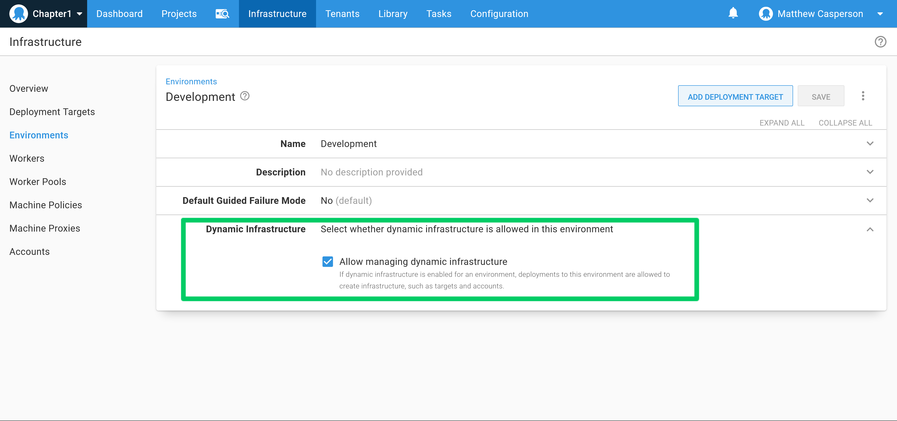
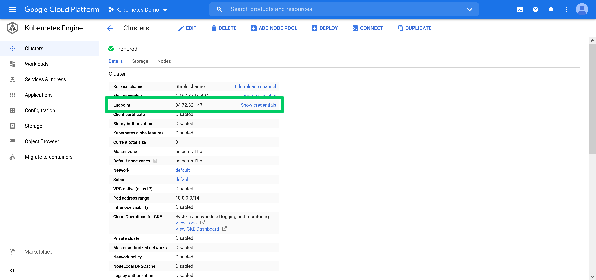
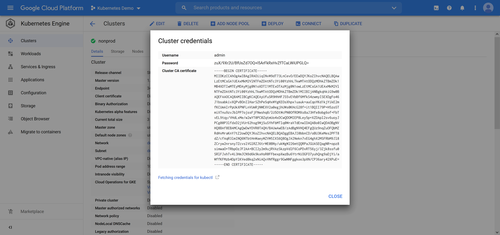
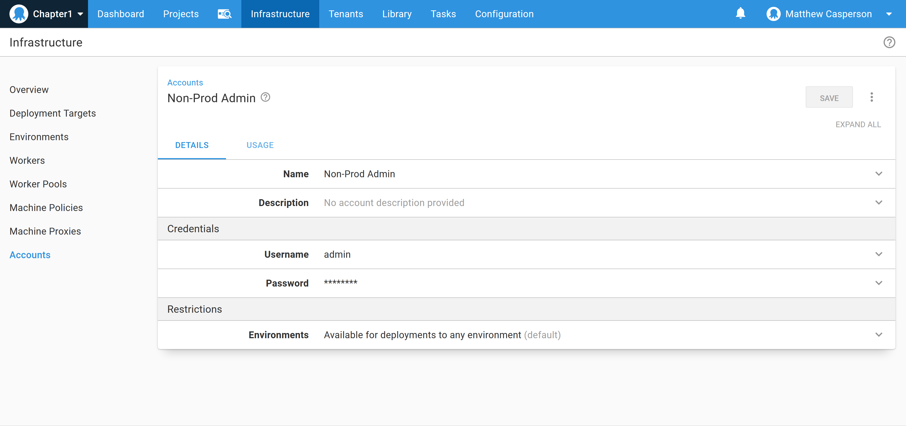
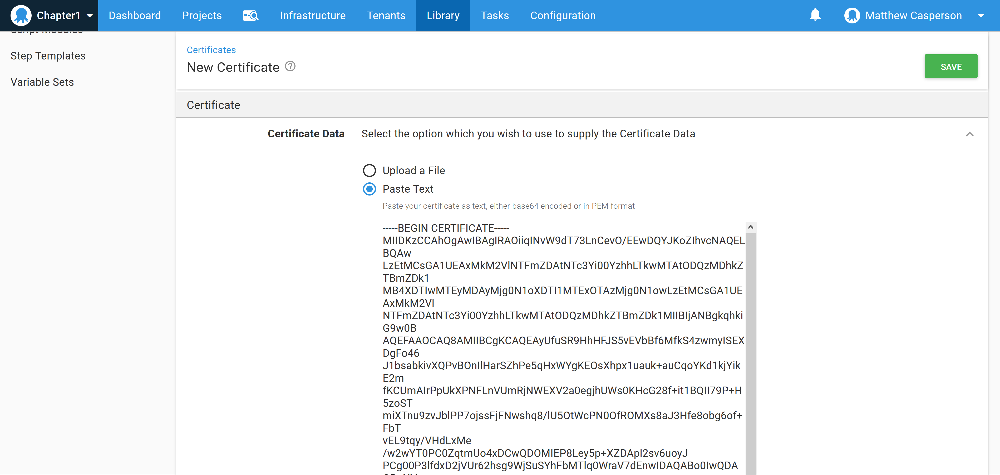
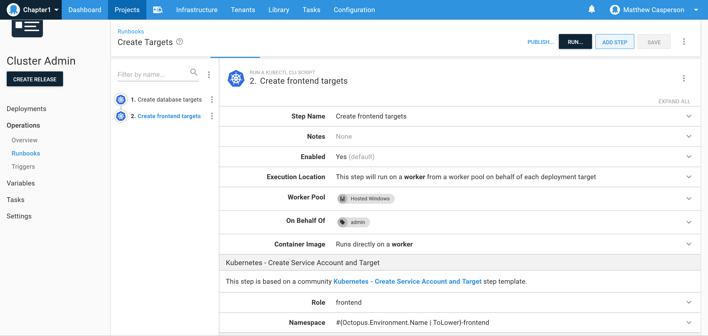
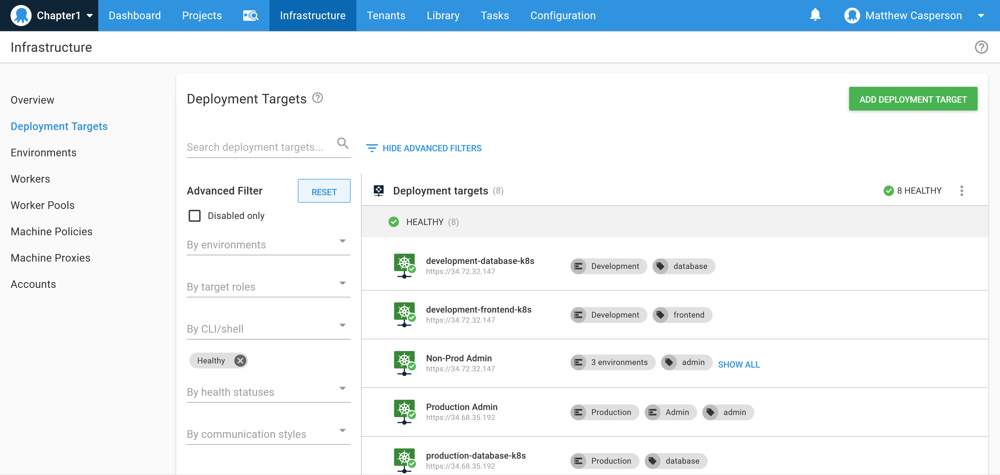

## Repeatable deployments

## Continuous Integration, Continuous Delivery and Continuous Deployment

The terms Continuous Integration and Continuous Delivery/Deployments, or CI/CD, are frequently used to describe the progression from source code to publicly accessible application.

For the purpose of this book, we consider Continuous Integration (CI) to be the process of compiling, testing and packaging an application as source code is updated. Specifically, in the case of Kubernetes deployments, CI is the process of packaging code as a Docker image, typically by a CI server.

Continuous Delivery and Continuous Deployments (both abbreviated to CD) have subtly different meanings. We treat both terms as an automated series of steps that deliver an application to its destination. The distinction is whether those automated steps deliver the application directly to the end consumer with no manual human intervention or decision making.

Continuous deployments have no manual human intervention. You have achieved Continuous Deployments when a commit to your source code is compiled, tested and packaged by your CI server, and then deployed, tested and exposed to end users. The success or failure of each stage of this process is automatic, resulting in a commit-to-consumer workflow.

Continuous delivery involves a human making the decision to progress a deployment to the final consumers. This progression is typically represented as a promotion though a series of environments. A canonical example of environmental progression is to deploy applications to the non-production development and test environments, and finally the production environment. 

A development environment may very well be configured with continuous deployments, where each commit that is successfully built by the CI server is automatically deployed with no human intervention. Once the developers are happy that their changes are suitable for a wider audience, a deployment can be promoted to the test environment.

The test environment is where quality assurance (QA) staff validate changes, product owners ensure functionality meets their requirements, security teams probe for vulnerabilities etc. Once everyone is happy that the changes meet their requirements, a deployment can be promoted to production.

The production environment is the final destination of a deployment, and is where applications are exposed to their final consumers. 

If you read blogs and tweets on the subject of CI/CD, you may be left with the impression that continuous deployments are the holy grail, and with continuous delivery being something of a poor substitute. However, what we have learned from most of our customers is that continuous delivery *works for them*. 

So while the majority of the pillars described in this book apply equally well to continuous delivery and continuous deployments, we'll approach them from a continuous delivery point of view.

:::hint
Deployment strategies like microservices are challenging the canonical notion of non-production and production environments. We'll explore this with the Seamless pillar in chapter 7.
:::hint

## What is a deployment?

In the previous section we talked about deploying "applications" to environments, which is typically how we talk about deployments. But to appreciate how repeatable deployments are achieved, we first need to be more specific about what we actually deploy.

In Octopus there are three things that are deployed to an environment:

1. The compiled applications (a Docker image in the case of a Kubernetes deployment) that are configured for a specific environment. Octopus refers to these as packages.
2. The variables, usually with a small subset specific to individual environments, that define how the applications are configured.
3. Scripts and configuration files written inline (i.e. not saved as files in packages) to support or define the application in an environment.

Octopus represents a deployment as a series of steps. These steps are configured with a combination of variables, package references and inline scripts and configuration files.

Octopus then creates a release. The release is a snapshot of the steps, their configuration, the variables, and the package versions that are to be deployed to an environment.

The release is then deployed to an environment. In this way a consistent bundle of packages, variables, scripts and configuration files are promoted from one environment to the next. Only a small subset of environment specific settings vary from one environment to the next.

The core design of Octopus embraces the pillar of repeatable deployments. The information contained in a release is deployed to each environment, ensuring that each environment is as close as possible to the others.

## Benefits of repeatable deployments

One of the primary reasons to progress a deployment through environments is to gain an increasing confidence that you are providing the end user with a working solution. This confidence can be built though testing (both manual and automated), manual sign off, using your own software internally (drinking your own champagne), early releases to test end users, or any number of other processes that allow issues to be identified before they impact end users.

However you only gain this confidence if the thing you are deploying to production is as close as possible to thing you have been verifying in non-production.

By embracing repeatable deployments, you can be sure that what your end users use in production is what you have been testing, verifying and gaining confidence in through your non-production environments.

## Modelling environments with Kubernetes

Now that we understand the benefits of progressing a deployment though environments, we can look at how Octopus environments are represented in Kubernetes.

There are two common methods to model environments in Kubernetes.

The first method to model environments is to use namespaces to partition a single cluster into many logical environments. 

A simple approach would be to create namespaces like `development`, `test`, and `production`, with releases being deployed inside each namespace. 

While easy to implement, this option does limit the ability to use Role Based Access Controls (RBAC) rules as a way of preventing rouge deployments from overwriting or deleting resources they shouldn't within an environment. Because RBAC rules apply to all resources of a certain type within a namespace (for example by allowing a specific Kubernetes user to create, update or delete pods) it is possible that a mistyped pod name in a deployment will overwrite an unrelated pod in the same namespace.

This limitation can be overcome by having separate namespaces for each combination of deployment and environment. For example, you may have six namespaces to contain the deployments for a frontend and backend application called `development-frontend`, `development-backend`, `test-frontend`, `test-backend`, `production-frontend`, `production-backend`. Six Kubernetes accounts could then be used to perform each deployment to each environment, with each account only having access to their intended namespace.

However, even when using fine grained namespaces to separate deployments, there are cases where Kubernetes resources can not be isolated. A classic example of this are Custom Resource Definitions (CRDs). CRDs are scoped to a cluster, and so can not be restricted to individual namespaces. It is also usually impractical to implement network bandwidth limits per namespace.

Kubernetes does not provide a hard tenancy model where multiple untrusted tenants, or environments in our case, can operate on a single cluster with guarantees that one tenant will not affect another. Namespaces go a long way to providing multi-tenancy within a single cluster, but do not provide a complete solution.

To address these limitations, environments can be implemented via the second method of using multiple clusters. Individual clusters provide a high degree of separation between environments, isolating shared resources like network traffic, cluster wide resources like CRDs, and node CPU and memory.

More likely you will use a combination of the two approaches by having a single cluster for the development and test environments, and a separate cluster for production.

## Kubernetes account types

To interact with Kubernetes resources, we need to authenticate with an account. [Kubernetes distinguishes between users accounts, which represent a human, and service accounts, which represent a machine](https://kubernetes.io/docs/reference/access-authn-authz/service-accounts-admin/#user-accounts-versus-service-accounts). Octopus supports both types of accounts when connecting to a cluster, but using a service account is recommended.

## Restricting Kubernetes access

RBAC is implemented in Kubernetes through roles and role bindings. Specifically, Kubernetes has four resources to define RBAC rules:

* Role: a namespace scoped resource that defines the allowed operations on resources in the role's namespace.
* RoleBinding: a namespace scoped resource that maps a role in role binding's namespace to a user or service account.
* ClusterRole: a cluster scoped resource that defines the allowed operations resources in all namespaces.
* ClusterRoleBinding: a cluster scoped resource that maps a cluster role to a user or service account.

In general terms, roles grant access to Kubernetes resources, and role bindings link accounts to roles.

The recommended strategy is to have service accounts with the minimum level of permissions required to deploy a single application to an environment. This provides a guarantee that a deployment to one environment, such as the development environment, can not accidentally overwrite resources in another environment, such as the test or production environments.

## Modelling Kubernetes environments in Octopus

Taken together, the combination of a cluster, account and namespace represent a security boundary into which a deployment can be performed. In Octopus, this security boundary is represented as a Kubernetes target.

The Kubernetes target is the link between the physical (i.e. separated clusters) or logical (i.e. separate namespaces) Kubernetes environments, the Octopus environments, and individual deployments that take place in those environments, which Octopus models as roles. 

:::hint
**Concept explanation: Octopus role**

You can think of as a tag describing the the type of application being deployed (e.g. `frontend` or `backend`) or management task that is performed (e.g. `admin` or `query`).
:::

## The example deployment

To demonstrate repeatable deployments, we'll deploy a sample application with a frontend and backend component to the development, test, and production environments. We'll create the development and test environments in one Kubernetes cluster, and the production environment in a second Kubernetes cluster.

The end result of our deployment is shown below:

*The Kubernetes and Octopus resources making up the deployment.*

### The Kubernetes cluster

Our deployments will be hosted by two Kubernetes clusters. The first hosts the development and test environments, while the second hosts the production environment.

Each cluster will have an initial user administrative user account to give them complete administrative rights to the cluster.

:::hint
How the initial admin user is created is unique to each cluster, and often dependant on the options used when creating the cluster. Hosted Kubernetes providers like [AWS EKS](https://aws.amazon.com/eks/), [Azure AKS](https://azure.microsoft.com/en-au/services/kubernetes-service/) and [Google Cloud GKE](https://cloud.google.com/kubernetes-engine) all create these initial admin users in different ways.

This book uses GKE with basic authentication to create the initial admin user.
:::

Each combination of environment and Octopus role and is represented as a namespace.

Inside each namespace is a service account, a Kubernetes role and a role binding. The Kubernetes role grants full access to all resources in the namespace, but do not grant access to any resources outside of the namespace.

:::hint
**Concept differentiation: Octopus and Kubernetes role**

A role in Octopus is a way of describing the type of application (e.g. `frontend` or `backend`) that a step and target deploy, or a management operator (e.g. `admin` or `query`) that a step or target will execute.

A role in Kubernetes is a resource that defines that allowed operations on other Kubernetes resources. A Kubernetes role is used as part of the RBAC security system.

Kubernetes roles and Octopus roles are separate concepts and do not have any overlapping responsibilities.
:::

### The Octopus configuration

The two initial administrative user accounts in the Kubernetes clusters will be represented in Octopus as Username/Password accounts.

:::hint
**Concept link: Octopus accounts, certificates, and Kubernetes users**

Credentials can be represented as either an account or a certificate in Octopus.

|Kubernetes User|Octopus entity|
|-|-|
|User|Either a Username/Password account, or a certificate.|
|Service Account|A token account containing the token held in the secret that is [automatically created with each new service account](https://kubernetes.io/docs/reference/access-authn-authz/service-accounts-admin/#token-controller).|
:::

The three environments development, test and production are represented as Octopus environments. In addition, we'll create a fourth environment called admin to represent management tasks performed at the cluster level.

:::hint
**Concept differentiation: Octopus and Kubernetes environments**

Octopus has a first class entity called an environment. It represents the physical and logic infrastructure to which deployments are performed. Octopus environments are also used as a security boundary, to scope other entities, and to enforce the order in which deployments take place.

Kubernetes has no native concept of an environment. We emulate an environment through the combination of namespaces and clusters. For example, any namespace that starts with `development` is considered to be part of the development environment.
:::

The two Kubernetes clusters are represented as two Kubernetes targets in Octopus. The targets reference the admin accounts described previously, meaning any deployment process or runbook that is executed in the context of these targets have administrative access to the cluster.

:::hint
**Concept differentiation: Octopus deployment process and runbooks**

A deployment process in Octopus is a series of steps executed sequentially. The deployment process is executed against each environment. Deployment processes are progressed through environments in a predictable order; for example you deploy to the development environment first, the test environment second, and the production environment third. This progression is defined by an Octopus lifecycle.

Runbooks are also a series of steps executed sequentially, but can be run against any environment in any order. They are often used to run management or support scripts rather than deploy applications.
:::

We will use these two administrative targets to dynamically create six additional targets representing the six namespaces in Kubernetes.

:::hint
**Concept explanation: Dynamic infrastructure**

Targets and other entities like accounts and certificates can be created in Octopus via the web UI, the REST API, or as part of a script run by Octopus. Entities created as part of a script run by Octopus are said to be [dynamic infrastructure](https://octopus.com/docs/infrastructure/deployment-targets/dynamic-infrastructure).

To allow dynamic infrastructure to be created in an environment, the **Allow managing dynamic infrastructure** option must be enabled on that environment:

:::

:::hint
**Concept explanation: API**

An Application Programming Interface (API) defines how applications interact with each other.

A REpresentational State Transfer Application Programming Interface (REST API) adheres to the semantics of the Hypertext Transfer Protocol (HTTP), which is the protocol used by web browsers. HTTP is ubiquitous, and so APIs built on top of it are easy to expose and access.

HTTP clearly identifies and differentiates interactions that result in information being retrieved, created, updated or deleted. REST APIs expose their underlying platform respecting these methods of interacting with information.
:::

## Creating the initial Octopus targets

This example uses Google Cloud GKE clusters. From these two clusters we need to import the following into Octopus:

* The username and password
* The Kubernetes cluster endpoint
* The Kubernetes cluster Certificate Authority (CA) certificate

:::hint
**Concept explanation: Certificate Authority**

A certificate authority is an organization or service that validates an identity. The identity and the validation of it is captured in a cryptographically secure way by signing a certificate. The certificate can be shared allowing the identity of parties involved in a transaction to be verified.

The CA itself is identified by a certificate. Certificates identifying CA's are called root certificates.

Certificates are used to secure web traffic, and they are required for HTTPS traffic through a web browser. Browsers supply their own collection of vetted root certificates, and so any certificate signed by one of these preinstalled root certificates is trusted by the browser.

Kubernetes exposes a REST API that uses the same underlying network stack used by browsers. This API is often secured with HTTPS. However, the CA used to sign the certificate protecting the Kubernetes HTTPS API is not usually known to the client (i.e. your own desktop or the Octopus server).

This means the cluster CA certificate must be explicitly downloaded and configured in order to be trusted by the tools interacting with the Kubernetes cluster.
:::

Here is a screenshot of the endpoint URL of a GKE cluster:

Here is a screenshot of the credentials and cluster CA certificate of a GKE cluster:

The credentials are provided as a username and password. These are captured as a Username/Password account in Octopus:

The certificate, supplied in the PEM format, can be pasted into Octopus as a new certificate:

:::hint
**Concept explanation: PEM format**

The Privacy Enhanced Mail (PEM) format is a plain text representation of a certificate, public key, and/or certificate chain. PEM files are popular with open source applications, and convenient to work with because they can be copied and pasted in a browser or text editor.

For a deeper discussion on certificates and formats, see this [video](https://www.youtube.com/watch?v=I01yI-FprMU&list=PLAGskdGvlaw02xL8jUBCF0DirsRZVZrjw&index=13).
:::

We can now create a Kubernetes target. The target will be scoped to the **Admin**, **Development**, and **Test** environments, and will have the role of **admin** applied to it. It will use the **Username and Password** authentication, and select the account created above. 

The **Kubernetes cluster URL** field is set to the **endpoint** IP address provided by the GKE console. We will secure the traffic sent to the endpoint by using HTTPS. The **Select certificate** option will select the certificate that we created above.

:::hint
**Concept link: Cluster URL and endpoint**

A Uniform Resource Locator (URL) is the address that you type into a browser to visit a website. It will look like `http://mywebsite.com` for an insecure website or `https://mywebsite.com` for a secure website.

Kubernetes uses the same network stack as your browser to communicate with it's API. When a program is interacting with a URL (as opposed to a human interacting with the URL), the URLs are sometimes referred to as endpoints.

A URL and an endpoint are the same thing. You can paste an endpoint into your browser, although you will likely see a response that only makes sense to a programmer rather than a usable web page.
:::

This process will be done twice to create two Kubernetes targets called **Non-Prod Admin** and **Prod-Admin**.

## Creating the environment and role specific targets

We now have two Kubernetes targets representing the two clusters. We will uses these targets to perform cluster wide actions. The first cluster wide actions we will perform is to:

* Create the six role and environment specific namespaces, 
* Create the six service accounts that will be used to deploy into them, 
* Create the six role and role bindings to grant the service accounts access to their (and only to their) namespace, and
* Create the six targets in Octopus to represent the role and environment namespaces in the cluster.

That is a lot of resources to create, but we can automate most of it through a runbook and a community step template designed to create everything for us.

:::hint
**Concept explanation: Community step templates**

The configuration of individual steps in Octopus can be captured as a template, allowing them to be reused. These templates can be shared with other Octopus users via the [Octopus Deploy Library](https://library.octopus.com/listing), which is a central, shared library of step templates. The steps included in the library are called community step templates.
:::

Start by creating a new project in Octopus called **Cluster Admin**.

:::hint
**Concept explanation: Project**

A project holds a deployment process and runbooks, although with project level variables and other settings relating to deployments and operations tasks.

A project can contain step deployment process to deploy one or more applications, or one or more runbooks to perform operations tasks, or a combination of both a deployment process and runbooks.

By sharing variables, a deployment process and the runbooks used to maintain the deployed application can be defined in one central location.
:::

Add a runbook called **Create Targets**. The runbook will have two steps, both based on the **Kubernetes - Create Service Account and Target** community step template.

The steps will both run on behalf of targets with the **admin** role.

:::hint
**Concept explanation: Run on worker, run on behalf of a target, run on target**

Steps can be executed in three different ways, defined under the **Execution Location** section.

The **Run once on worker** option executes the step on a worker. The executing step has no knowledge of a target, and so is typically used by steps that perform work through external APIs. With this option selected, a step will be executed once per deployment.

The **Run on a worker on behalf of each deployment target** option executes the step on a worker, but with the context of each target that matches the selected role and environment available to the step. With this option selected, a step will be executed once for each matching target.

The **Run on each deployment target** option executes the step on the target. This is to execute code on a physical machine or VM with a tentacle installed. With this option selected, a step will be executed once for each matching target.
:::

:::hint
**Concept explanation: Tentacles**

An Octopus tentacle is an agent that is installed on a physical machine or virtual machine. Tentacles execute steps directly on the target machine, and are used to copy artifacts, run scripts, or perform deployments from a process running on target machine's operating system.

Other target types, like the Kubernetes target, capture the details required to connect to the target, but do not run on the target. Kubernetes targets are used to configure the Kubernetes configuration file used by the `kubectl` executable, which allows deployments and operations tasks to be performed on the Kubernetes cluster.
:::

:::hint
**Concept explanation: Workers**

There is a one to many relationship between deployments and targets. For example, if you had three virtual machines configured as tentacle targets, with each of the targets having the role `webapp`, and a deployment step configured to execute on targets with the role of `webapp`, the step would perform the deployment three times - one for each target.

Workers are interchangeable execution locations where steps can be run without a target, or on behalf of a target. When a worker is required, one is selected from a worker pool, the step is executed, and the worker is returned to the pool.

All Kubernetes steps in Octopus run on a worker, on behalf of a target. 
:::

The **Role** field defines the role that will be assigned to the newly created Kubernetes target. The first step will create targets with the role `frontend` to represent our web application, and the second step will create targets with the role `backend` to represent our database

The **Namespace** field defines the Kubernetes namespace that will host the service account, role and role binding created by the step. The first step will create a namespace called `#{Octopus.Environment.Name | ToLower}-database`, and the second step will create a namespace called `#{Octopus.Environment.Name | ToLower}-frontend`. We make use of variable templates to build the final value from the name of the environment and a fixed suffix.

:::hint
**Concept explanation: Variable templates**

Most fields in Octopus steps accept a value that can be constructed from variables. These variables are referenced in a marker that starts with a pound, open curly bracket (`#{`), the name of the variable, and a closing curly bracket (`}`).

Filters can be applied to the variable after a pipe symbol (`|`). Filters process the value returned by the variable in some way. For example you can convert the value to upper case characters with the `ToUpper` filter or lowercase characters with the `ToLower` filter. The [documentation](https://octopus.com/docs/projects/variables/variable-filters) contains a complete list of the available filters.
:::

When the step is run, the namespace configured in the step will be created if it does not exist, and a service account, role and role binding will be created in the namespace granting the service account access to all resources in the namespace.

Each service account has a corresponding Kubernetes secret that contains the token used for authentication. The step will read this secret and create an Octopus Token account with the credentials.

Finally a Kubernetes target will be created configured with the token account and defaulting to the new namespace. Because the token authenticates as the associated service account, and the service account only has access to its own namespace, the Octopus target can only be used to deploy to a single namespace. This ensures that deployments can not leak between environments/namespaces.

Execute the runbooks against the development, test and production environments. The steps will create all the required Kubernetes resources and Octopus entities, resulting in a total of eight targets in our Octopus space.

:::hint
**Concept explanation: Spaces**

Spaces are hard boundaries that are used to partition a single Octopus instance allowing multiple teams or projects to work independently. Most Octopus entities are scoped to a single space and can not be shared across spaces.
:::

## Conclusion